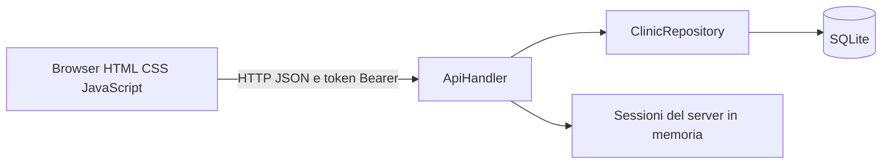
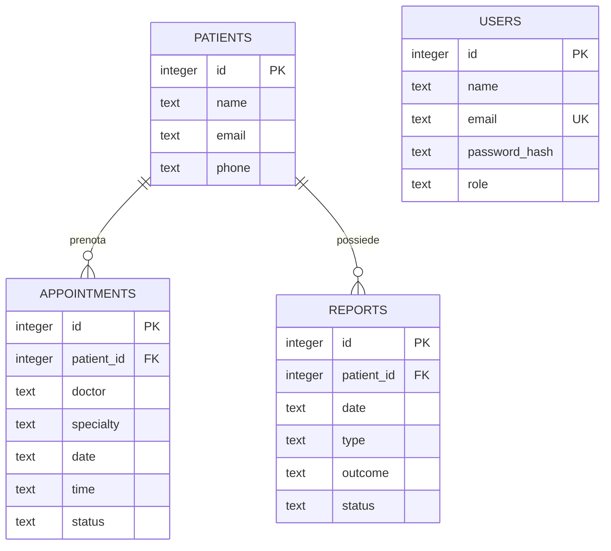
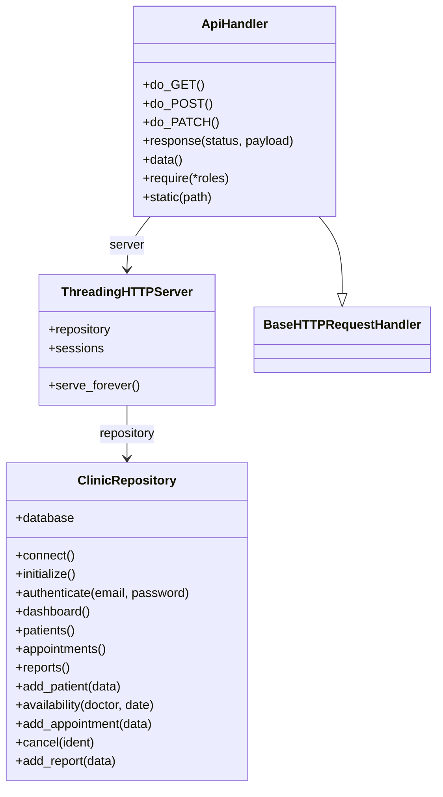

# Progettazione di SanitaSmart

## Scenario e confini

Prototipo didattico per una clinica polispecialistica di esempio. La traccia propone servizi alternativi: il progetto sceglie prenotazione visite, gestione dei pazienti e consultazione dei referti. La dashboard espone indicatori operativi, non contabilità, ricavi o margini. I dati sono fittizi.

## Architettura

`create_server(port, database)` costruisce il repository e un `ThreadingHTTPServer`, assegnandogli archivio e sessioni. Importare `app.py` non apre il database. La funzione `run()` avvia l'applicazione locale; i test scelgono una porta libera e un file temporaneo. Le connessioni SQLite vengono chiuse al termine di ogni operazione, con commit o rollback automatico.

## Modello ER implementato

`users` autentica gli operatori: non esiste una chiave esterna fra medico della visita e utente. `reports` è collegata al paziente, non all'appuntamento. Le chiavi esterne sono abilitate in ogni connessione. L'indice univoco parziale `active_doctor_slot` protegge la combinazione medico, data e ora quando lo stato è `Confermata`; l'annullamento cambia lo stato senza cancellare il record.

Date e ore vengono normalizzate prima della scrittura. Gli slot ammessi sono ogni 30 minuti dalle 09:00 alle 12:30 e dalle 14:00 alle 17:30. Il controllo avviene anche sul server. Il medico resta un nome testuale: grafie diverse non sono ricondotte automaticamente alla stessa persona.

## Classi e responsabilità

## Autorizzazioni

| Operazione | Admin | Segreteria | Medico |
| --- | --- | --- | --- |
| Consultazione dati e disponibilità | Sì | Sì | Sì |
| Creazione pazienti | Sì | Sì | No |
| Prenotazione e annullamento | Sì | Sì | No |
| Pubblicazione referti via API | Sì | No | Sì |

Il token opaco del login è conservato in `sessionStorage` dal browser e nel dizionario del server. Il logout revoca soltanto il token ricevuto, restituisce 204 senza corpo e funziona anche con token già assente. La versione corrente risponde 401 sia a token non valido sia a ruolo insufficiente. Il riavvio conserva i dati, ma azzera le sessioni. Non sono implementati scadenza dei token o permessi per singolo paziente.

## Scelte e alternative

- SQLite riduce i componenti necessari per una dimostrazione locale; un database separato richiederebbe gestione di un servizio aggiuntivo.
- Il repository concentra query e regole; il gestore si occupa di HTTP e accesso. Il backend rimane volutamente compatto.
- L'indice nel database protegge dalle richieste concorrenti; il solo elenco di orari nel browser non sarebbe sufficiente.
- L'annullamento conserva il record per la consultazione, ma non sostituisce una cronologia completa delle modifiche.
- Il frontend usa JavaScript nativo: rende leggibile il flusso, ma richiede la gestione esplicita delle risposte e degli errori.

## Contratto e verifiche

Il contratto completo delle 12 operazioni è in `../openapi.yaml`, scritto nella sintassi JSON compatibile con YAML 1.2. Comprende richieste, risposte, errori e autenticazione. I test confrontano anche le risposte HTTP con gli schemi documentati. La documentazione non implica che ogni input possibile sia stato verificato.

Le prove funzionali e le schermate aggiornate sono descritte in `verifiche.md`. I limiti residui riguardano soprattutto anagrafica medici, collegamento referto-visita, distribuzione reale e gestione del ciclo di vita degli account.
